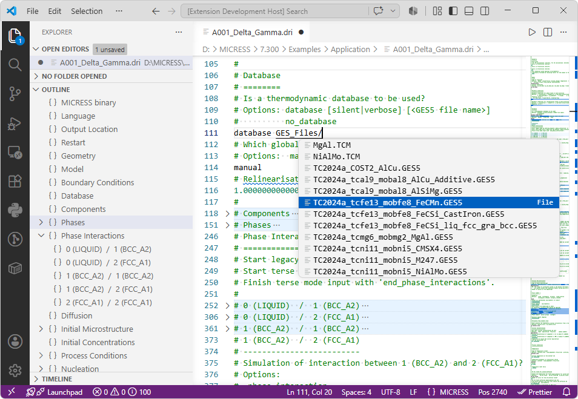

# MICRESS Extension for Visual Studio Code

The **MICRESS Extension** adds language support for MICRESS driving files (`.dri`) in Visual Studio Code, providing editing and navigation features designed for efficient work with large simulation input files.

## Features

- **Syntax highlighting** for MICRESS driving files.
- **Path completion and navigation** with intelligent suggestions and clickable links for file and directory paths.
- **Outline view support** for quick navigation between sections.
- **Code folding** for collapsing and expanding logical sections.
- **Section decorations** for improved readability and visual organization.

## Usage

1. Install the extension from the Visual Studio Code Marketplace.
2. Open a MICRESS driving file (.dri).
3. Start editing with full MICRESS language support.

## Release Notes

### Version 0.2.0

- Added intelligent path completion.
- Added clickable navigation for existing file and directory paths.

### Version 0.1.0

Initial release featuring:

- Syntax highlighting
- Outline navigation
- Section folding
- Section separator decorations

## Contributing

Bug reports, feature requests, and contributions are welcome. Please open an issue or submit a pull request through the project repository.
